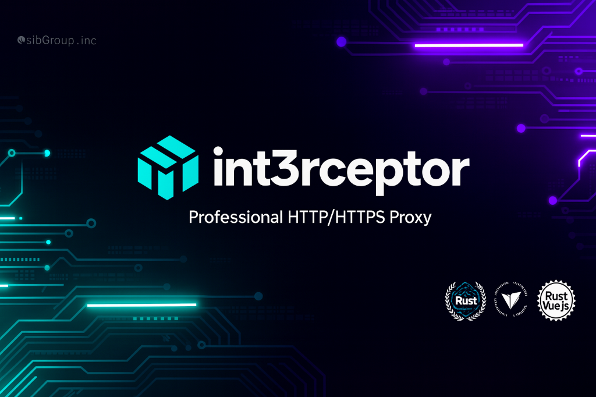
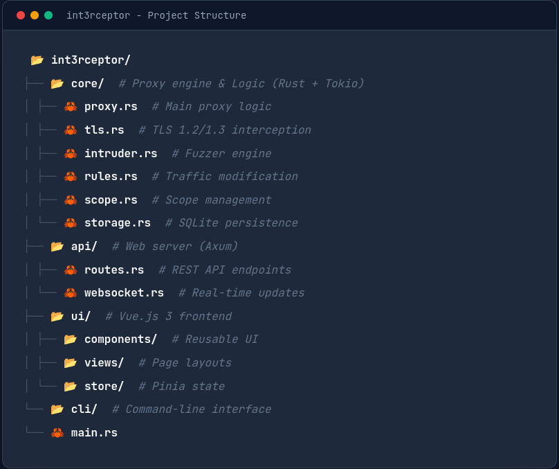

<div align="center">



# 🎯 Interceptor

### Professional HTTP/HTTPS Intercepting Proxy

[](interceptor/LICENSE)
[](https://www.rust-lang.org/)
[](https://vuejs.org/)
[](interceptor/LICENSE_COMMERCIAL.md)

**A modern, high-performance security testing platform built with Rust and Vue.js**

[Features](#-features) • [Quick Start](#-quick-start) • [Documentation](#-documentation) • [Commercial License](#-commercial-licensing)

</div>

---

## 🌟 Overview

**Interceptor** is a **proprietary** HTTP/HTTPS intercepting proxy designed for security professionals, penetration testers, and developers. Built with **Rust** for maximum performance and **Vue.js** for a modern user experience, it rivals commercial tools like Burp Suite but with a focus on speed and modern architecture.

### 🔒 Licensing

- ✅ **Free for Personal/Non-Commercial Use**
- ✅ **Source Available** for transparency and auditing
- 💼 **Commercial License Required** for business use
- 🔒 **Proprietary** - All rights reserved by S1BGr0uP

---

## ✨ Features

### 🔍 **Traffic Interception**

Full HTTP/HTTPS proxy with TLS MITM, automatic certificate generation, and real-time WebSocket capture.

### 🎯 **Intruder / Fuzzer**

Automated payload injection with 4 attack modes (Sniper, Battering Ram, Pitchfork, Cluster Bomb) and pre-loaded security payloads.

### 🔧 **Rule Engine**

Powerful traffic modification engine. Match by URL, Header, or Body and perform actions like Replace, Set Header, or Drop.

### ⚡ **Regex Matchers (v2.0)**

Advanced pattern matching with capture groups and intelligent caching for high-performance traffic analysis.

### 🔌 **WebSocket Interception (v2.0)**

Full frame capture (Text, Binary, Ping/Pong), bidirectional monitoring, and connection tracking.

---

## 🚀 Quick Start

### Prerequisites

- **Rust** 1.70+
- **Node.js** 18+

### Installation

```bash
# Clone the repository
git clone https://github.com/S1b-Team/int3rceptor.git
cd int3rceptor/interceptor

# Build and Run
cargo run --release
```

For full installation details, see the [Development Guide](interceptor/docs/DEVELOPMENT.md).

---

## 📖 Documentation

### User Guides

- **[Traffic Tab](interceptor/docs/TRAFFIC.md)**: Capture and analyze traffic
- **[Intruder Tab](interceptor/docs/INTRUDER.md)**: Automated fuzzing
- **[Rules Tab](interceptor/docs/RULES.md)**: Traffic modification
- **[Scope Tab](interceptor/docs/SCOPE.md)**: Filter traffic
- **[Repeater Tab](interceptor/docs/REPEATER.md)**: Replay requests

### Technical Docs

- **[API Reference](interceptor/docs/API.md)**
- **[Configuration](interceptor/docs/CONFIG.md)**

---

## 💼 Commercial Licensing

**Interceptor is free for personal use.** For commercial use (business, consulting, pen-testing services), a license is required.

| License Tier   | Price               | Features                                    |
| :------------- | :------------------ | :------------------------------------------ |
| **Individual** | **$59/year**        | Commercial use, 2 servers                   |
| **Lifetime**   | **$249** (One-time) | **Forever updates**, Priority support badge |
| **Startup**    | $499/year           | 10 users, 5 servers, Email support          |
| **Enterprise** | Custom              | Unlimited, SSO, SLA, Source mods            |

## 🏗️ Architecture

<div align="center">



</div>

📧 **Contact**: s1bgr0up.root@gmail.com  
📄 **Details**: [LICENSE_COMMERCIAL.md](interceptor/LICENSE_COMMERCIAL.md)

---

<div align="center">

**⭐ Star us on GitHub — it motivates us a lot!**

Made with 🦀 Rust and 🖼️ Vue.js by [S1BGr0uP](https://github.com/S1BGr0uP)

</div>
