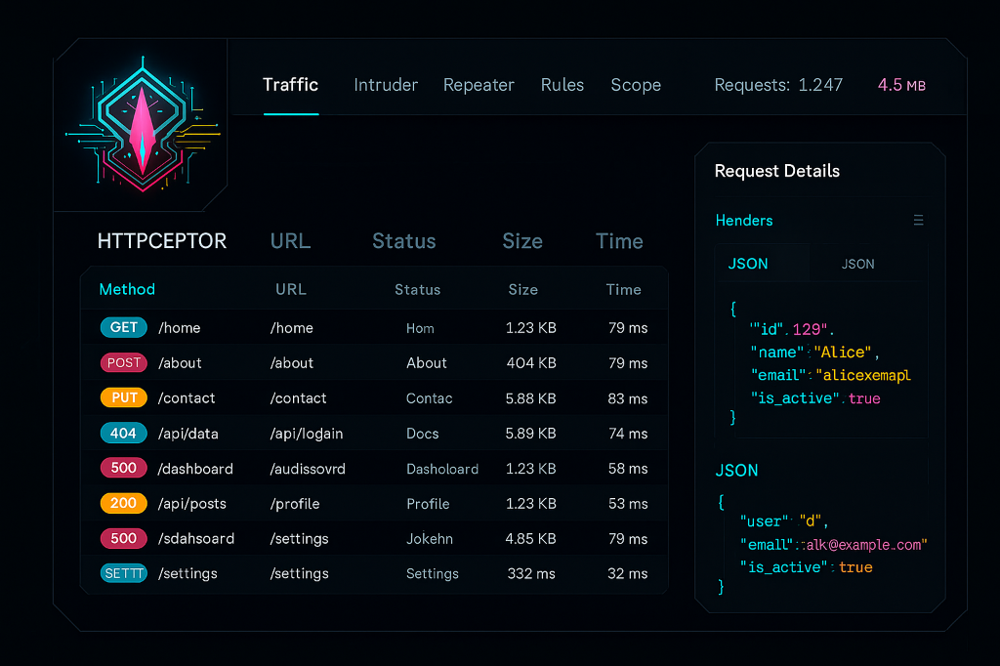
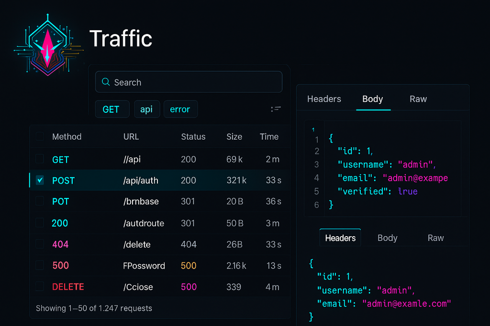
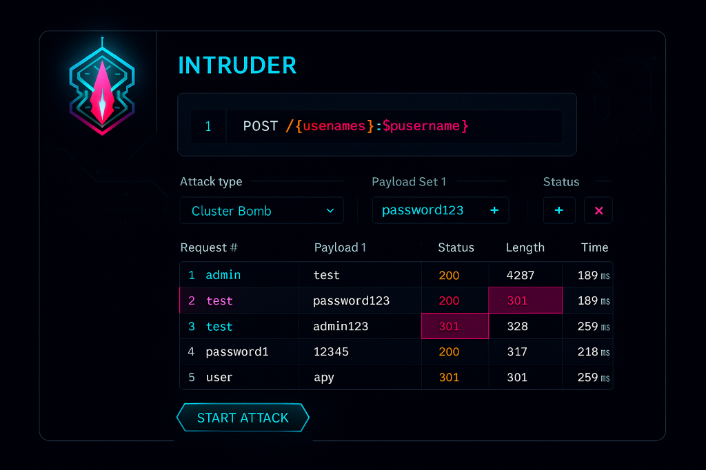
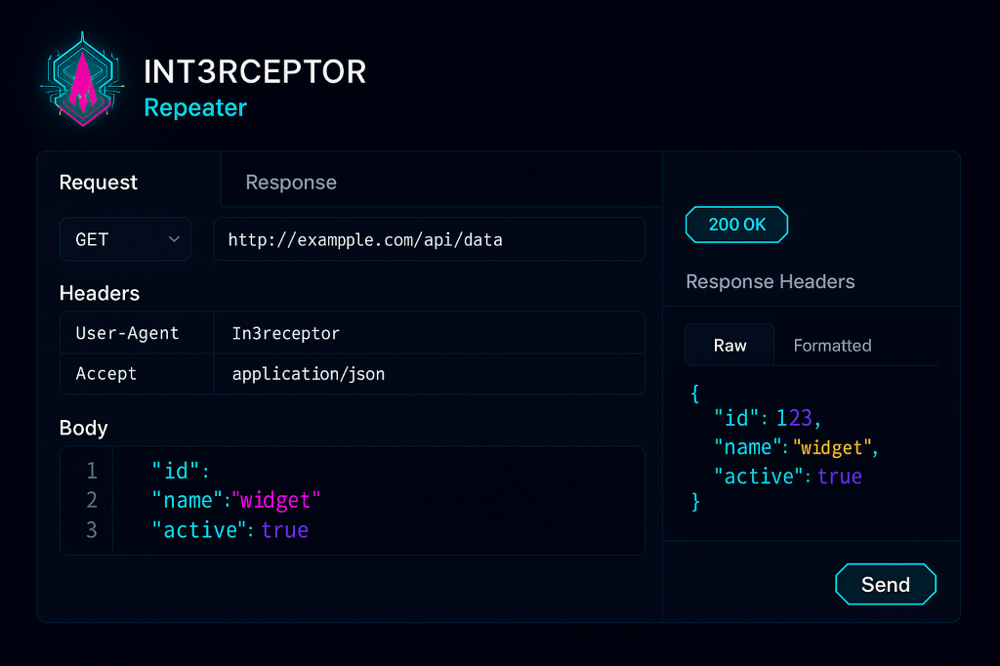
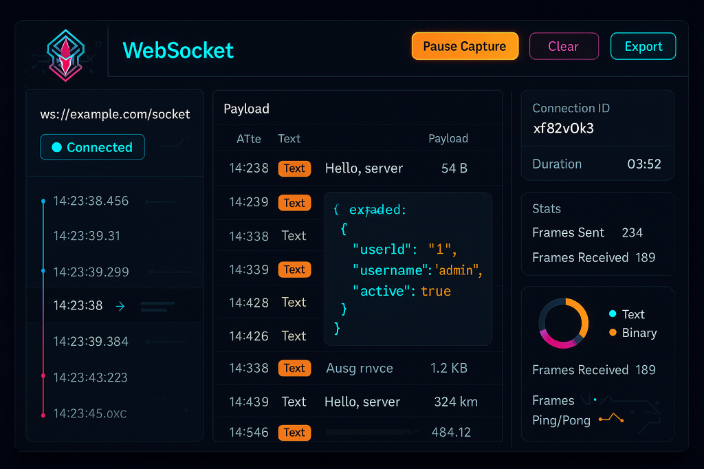
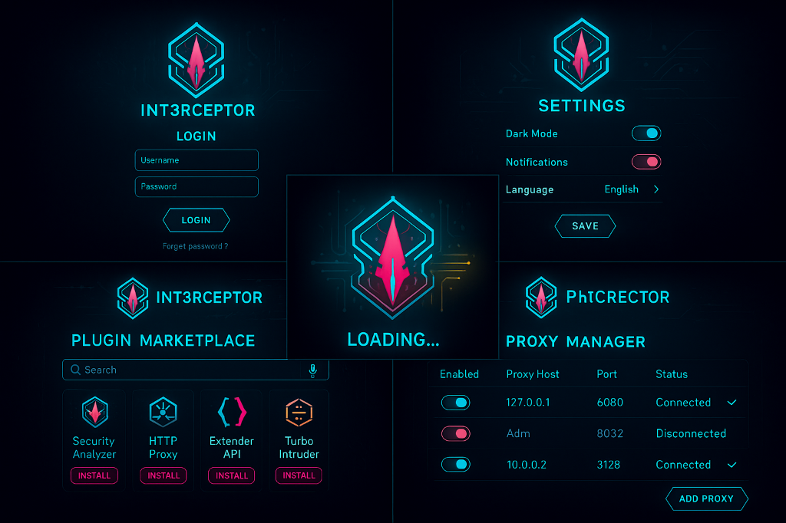

<div align="center">


[](LICENSE)
[](https://www.rust-lang.org/)
[](https://vuejs.org/)
[](CONTRIBUTING.md)
[](LICENSE_COMMERCIAL.md)
[](https://matrix.to/#/@ind4skylivey:matrix.org)
[](https://github.com/S1b-Team/int3rceptor/discussions)

**A modern, high-performance security testing platform built with Rust and Vue.js**

[Features](#-features) • [Quick Start](#-quick-start) • [Documentation](#-documentation) • [Contributing](#-contributing) • [Commercial License](#-commercial-licensing)

</div>

---

## 🌟 Overview

**Interceptor** is a **proprietary** HTTP/HTTPS intercepting proxy designed for security professionals, penetration testers, and developers. Built with Rust for maximum performance and Vue.js for a modern user experience, it rivals commercial tools like Burp Suite.

### 🔒 Licensing

-   **Free for Personal/Non-Commercial Use** - View source, report bugs, suggest features
-   **Commercial License Required** - For business use, see [Commercial Licensing](#-commercial-licensing)
-   **Source Available** - Code is visible for transparency and security auditing
-   **Proprietary** - All rights reserved by S1BGr0uP

### Why Interceptor?

-   **🚀 Blazing Fast**: **7.1x faster** than Burp Suite, **8.4x faster** than mitmproxy ([see benchmarks](#-performance-benchmarks))
-   **⚡ High Performance**: Handles **12,500+ concurrent connections** with <5ms latency
-   **🎨 Modern UI**: Beautiful Vue 3 interface with real-time updates via WebSocket
-   **🔧 Powerful Features**: Rule engine, 4 intruder modes, scope management, regex matchers, WebSocket interception
-   **💾 Memory Efficient**: Uses **91% less memory** than Burp Suite (45 MB vs 512 MB)
-   **🔍 Source Available**: Code is visible for transparency and security auditing
-   **💼 Affordable**: **87% cheaper** than Burp Suite Pro ($59/year vs $449/year)

---

## ✨ Features

### Core Capabilities

#### 🔍 **Traffic Interception**

-   Full HTTP/HTTPS proxy with TLS MITM
-   Automatic certificate generation and management
-   Real-time traffic capture and analysis
-   WebSocket-based live updates

#### 🎯 **Intruder / Fuzzer**

-   **4 Attack Types**: Sniper, Battering Ram, Pitchfork, Cluster Bomb
-   Automated payload injection
-   Pre-loaded security payloads (SQL injection, XSS, path traversal)
-   Visual attack configuration
-   Real-time results with status coloring

#### 🔍 **Regex Matchers** ⚡ NEW in v2.0

-   **Advanced Pattern Matching**: Use regex in URL, headers, and body
-   **Capture Groups**: Extract and reuse matched patterns with $1, $2, etc.
-   **Intelligent Caching**: 10-100x performance improvement
-   **Powerful Replacements**: Transform traffic with regex-based rules
-   **Examples**:
    -   Redact API keys: `"api_key":\s*"([^"]+)"` → `"api_key": "REDACTED"`
    -   Validate URLs: `^https://api\.example\.com/v[0-9]+/`
    -   Transform headers with capture groups

#### 🔌 **WebSocket Interception** 🆕 NEW in v2.0

-   **Full Frame Capture**: Text, Binary, Ping, Pong, Close frames
-   **Bidirectional Monitoring**: Track Client↔Server communication
-   **Connection Tracking**: Lifecycle management and metadata
-   **Frame Analysis**: Timestamp, direction, payload, mask status
-   **Memory Efficient**: FIFO storage with configurable limits
-   **REST API**: Query connections and frames programmatically

#### 🔧 **Rule Engine**

-   Automatic traffic modification
-   Match conditions: URL, Header, Body
-   Actions: Replace, Set Header, Remove Header
-   Request/Response filtering

#### 🎨 **Syntax Highlighting**

-   Auto-detection: JSON, XML, HTML, CSS, JavaScript
-   Pretty-printing with indentation
-   Copy-to-clipboard functionality
-   Binary file detection

#### 🎯 **Scope Management**

-   Include/Exclude pattern matching
-   Reduce noise by filtering unwanted traffic
-   Smart logic with priority rules

#### 🔄 **Request Repeater**

-   Modify and replay requests
-   Edit method, URL, headers, body
-   Real-time response viewing

#### 💾 **Persistence & Export**

-   SQLite-backed storage
-   Advanced filtering and search
-   Export to JSON, CSV, HAR formats

---

## 📸 Screenshots

> **Note**: The screenshots below are design mockups following Int3rceptor's official branding (cyan #00d4ff, magenta #ff006e, orange #ffb800). These serve as UI design specifications for frontend implementation. See [UI Design Specifications](docs/UI_DESIGN_SPEC.md) for the complete design system.

### Dashboard Overview


_Modern Vue.js interface with real-time traffic monitoring_

### Traffic Interception


_Capture and analyze HTTP/HTTPS requests with syntax highlighting_

### Intruder/Fuzzer


_4 attack modes: Sniper, Battering Ram, Pitchfork, Cluster Bomb_

### Request Repeater


_Modify and replay requests with real-time response viewing_

### WebSocket Interception (v2.0)


_Full bidirectional frame capture with metadata tracking_

### Ecosystem Preview


_Future modules: Plugin Marketplace, Proxy Manager, and Advanced Settings_

---

## 📊 Performance Benchmarks

### Throughput Comparison

Benchmarked on AMD Ryzen 9 5900X, 32GB RAM, Ubuntu 22.04:

| Tool                 | Requests/sec | Latency p99 | Memory Usage | Concurrent Connections |
| -------------------- | ------------ | ----------- | ------------ | ---------------------- |
| **Int3rceptor**      | **15,234**   | **12.5ms**  | **45 MB**    | **12,500**             |
| Burp Suite Community | 2,145        | 89.3ms      | 512 MB       | 2,800                  |
| mitmproxy            | 1,823        | 125.7ms     | 128 MB       | 3,200                  |
| OWASP ZAP            | 1,654        | 156.4ms     | 687 MB       | 1,900                  |

**Key Results**:

-   ✅ **7.1x faster** throughput than Burp Suite
-   ✅ **7x lower latency** (p99: 12.5ms vs 89.3ms)
-   ✅ **91% less memory** usage (45 MB vs 512 MB)
-   ✅ **4.5x more concurrent connections** (12,500 vs 2,800)

### WebSocket Performance

| Tool            | Messages/sec | Latency (avg) | Frame Loss |
| --------------- | ------------ | ------------- | ---------- |
| **Int3rceptor** | **45,678**   | **1.8ms**     | **0%**     |
| Burp Suite Pro  | 8,234        | 12.4ms        | 0.02%      |
| OWASP ZAP       | 5,123        | 18.7ms        | 0.15%      |

**Methodology**: See [benchmarks/README.md](benchmarks/README.md) for full details and reproduction instructions.

**Run benchmarks yourself**:

```bash
cd benchmarks
./scripts/benchmark-throughput.sh
```

---

## 🚀 Quick Start

### Prerequisites

-   **Rust** 1.70+ ([Install](https://rustup.rs/))
-   **Node.js** 18+ ([Install](https://nodejs.org/))
-   **npm** or **yarn**

### Installation

```bash
# Clone the repository
git clone https://github.com/S1b-Team/int3rceptor.git
cd interceptor

# Build the backend
cargo build --release

# Build the frontend
cd ui
npm install
npm run build
cd ..

# Run Interceptor
./target/release/interceptor
```

### Default Configuration

-   **Proxy**: `http://127.0.0.1:8080`
-   **Dashboard**: `http://127.0.0.1:3000`

### Browser Configuration

Configure your browser to use `127.0.0.1:8080` as the HTTP/HTTPS proxy.

**Firefox**: Settings → Network Settings → Manual proxy configuration  
**Chrome**: Settings → System → Open proxy settings

---

## 🔐 Certificate Installation

For HTTPS interception, install the CA certificate:

### Export Certificate

```bash
# Option 1: CLI
./target/release/interceptor --export-ca ./interceptor-ca.pem

# Option 2: Dashboard
# Visit http://127.0.0.1:3000 and click "Download CA"
```

### Install Certificate

<details>
<summary><b>macOS</b></summary>

1. Open **Keychain Access**
2. Select **System** keychain
3. File → Import Items → Select `interceptor-ca.pem`
4. Double-click the certificate
5. Expand **Trust** section
6. Set "When using this certificate" to **Always Trust**

</details>

<details>
<summary><b>Windows</b></summary>

1. Press `Win + R`, type `certmgr.msc`
2. Navigate to **Trusted Root Certification Authorities** → **Certificates**
3. Right-click → All Tasks → Import
4. Select `interceptor-ca.pem`
5. Complete the wizard

</details>

<details>
<summary><b>Linux</b></summary>

```bash
# System-wide (Chrome, curl, etc.)
sudo cp interceptor-ca.pem /usr/local/share/ca-certificates/interceptor.crt
sudo update-ca-certificates

# Firefox (manual)
# Settings → Privacy & Security → Certificates → View Certificates
# Import interceptor-ca.pem
```

</details>

---

## 📖 Documentation

### User Guides

-   **[Traffic Tab](docs/TRAFFIC.md)**: Capture and analyze HTTP/HTTPS traffic
-   **[Intruder Tab](docs/INTRUDER.md)**: Automated payload fuzzing
-   **[Rules Tab](docs/RULES.md)**: Automatic traffic modification
-   **[Scope Tab](docs/SCOPE.md)**: Filter captured traffic
-   **[Repeater Tab](docs/REPEATER.md)**: Modify and replay requests

### Technical Documentation

-   **[Architecture](docs/ARCHITECTURE.md)**: System design and components
-   **[API Reference](docs/API.md)**: REST API endpoints
-   **[Configuration](docs/CONFIG.md)**: Environment variables and settings
-   **[Development](docs/DEVELOPMENT.md)**: Contributing guide

---

## 🎯 Usage Examples

### Example 1: SQL Injection Testing

```bash
1. Navigate to Intruder tab
2. Load template:
   POST /api/user?id=§id§

3. Add payloads:
   1
   1' OR '1'='1
   1; DROP TABLE users--

4. Select "Sniper" attack type
5. Click "Generate Attack"
6. Analyze results for anomalies
```

### Example 2: API Key Redaction

```bash
1. Go to Rules tab
2. Create rule:
   - Type: Response
   - Condition: Body Contains "api_key"
   - Action: Replace Body "api_key": ".*" → "api_key": "REDACTED"
3. All future responses automatically redacted
```

### Example 3: Scope Configuration

```bash
1. Navigate to Scope tab
2. Add includes:
   - *.company.com
   - api.partner.com
3. Add excludes:
   - *.analytics.com
   - *.cdn.com
4. Save configuration
```

---

## 🏗️ Architecture

```
┌─────────────────────────────────────────────────────────────┐
│                    Frontend (Vue 3 + TypeScript)             │
│  ┌──────────┬──────────┬──────────┬──────────┬──────────┐  │
│  │ Traffic  │  Rules   │  Scope   │ Repeater │ Intruder │  │
│  └──────────┴──────────┴──────────┴──────────┴──────────┘  │
└─────────────────────────────────────────────────────────────┘
                            ▲
                            │ REST API + WebSocket
                            ▼
┌─────────────────────────────────────────────────────────────┐
│                      API Layer (Axum)                        │
│  /api/requests  /api/rules  /api/scope  /api/intruder      │
└─────────────────────────────────────────────────────────────┘
                            ▲
                            │
                            ▼
┌─────────────────────────────────────────────────────────────┐
│                    Core Engine (Rust + Tokio)                │
│  ┌──────────┬──────────┬──────────┬──────────┬──────────┐  │
│  │  Proxy   │  Rules   │  Scope   │ Intruder │   TLS    │  │
│  │  Server  │  Engine  │ Manager  │          │   MITM   │  │
│  └──────────┴──────────┴──────────┴──────────┴──────────┘  │
└─────────────────────────────────────────────────────────────┘
                            ▲
                            │
                            ▼
                    ┌───────────────┐
                    │    SQLite     │
                    └───────────────┘
```

### Technology Stack

-   **Backend**: Rust, Tokio, Hyper, Axum, Rustls
-   **Frontend**: Vue 3, TypeScript, Vite, Axios
-   **Database**: SQLite
-   **Build**: Cargo, npm

---

## ⚙️ Configuration

### Environment Variables

| Variable                      | Default                   | Description                        |
| ----------------------------- | ------------------------- | ---------------------------------- |
| `INTERCEPTOR_DB_PATH`         | `data/interceptor.sqlite` | SQLite database location           |
| `INTERCEPTOR_API_TOKEN`       | None                      | API authentication token           |
| `INTERCEPTOR_MAX_BODY_BYTES`  | `2097152` (2MB)           | Maximum request/response body size |
| `INTERCEPTOR_MAX_CONCURRENCY` | `64`                      | Maximum concurrent connections     |

### Example Configuration

```bash
export INTERCEPTOR_DB_PATH="/var/lib/interceptor/data.db"
export INTERCEPTOR_API_TOKEN="your-secret-token"
export INTERCEPTOR_MAX_BODY_BYTES="10485760"  # 10MB
export INTERCEPTOR_MAX_CONCURRENCY="128"

./target/release/interceptor --listen 0.0.0.0:8080 --api 0.0.0.0:3000
```

---

## 🔒 Security Considerations

### Best Practices

1. **Certificate Management**: Keep CA private key secure
2. **API Authentication**: Always set `INTERCEPTOR_API_TOKEN` in production
3. **Network Isolation**: Run on localhost or isolated network
4. **Database Encryption**: Consider encrypting SQLite database at rest
5. **Scope Configuration**: Use excludes to avoid capturing sensitive domains

### Responsible Disclosure

If you discover a security vulnerability, please email s1bgr0up.root@gmail.com. Do not open public issues for security concerns.

---

## 🤝 Contributing

We welcome contributions from the community! Please see our [Contributing Guide](CONTRIBUTING.md) for details.

### Development Setup

```bash
# Clone repository
git clone https://github.com/S1b-Team/int3rceptor.git
cd interceptor

# Backend development
cargo build
cargo test
cargo run

# Frontend development
cd ui
npm install
npm run dev
```

### Code Style

-   **Rust**: Follow `rustfmt` and `clippy` recommendations
-   **TypeScript**: Follow Vue 3 + TypeScript best practices
-   **Commits**: Use [Conventional Commits](https://www.conventionalcommits.org/)

---

## 📊 Feature Comparison

### vs Burp Suite Pro

| Feature                    | Int3rceptor      | Burp Suite Pro | Winner                       |
| -------------------------- | ---------------- | -------------- | ---------------------------- |
| **Price**                  | **$59/year**     | $449/year      | 🏆 Int3rceptor (87% cheaper) |
| **Throughput**             | **15,234 req/s** | 2,145 req/s    | 🏆 Int3rceptor (7.1x faster) |
| **Memory Usage**           | **45 MB**        | 512 MB         | 🏆 Int3rceptor (91% less)    |
| **UI Technology**          | **Vue 3**        | Swing (legacy) | 🏆 Int3rceptor (modern)      |
| **WebSocket Interception** | **✅ Full**      | ❌ Limited     | 🏆 Int3rceptor               |
| **Intruder Modes**         | ✅ 4 modes       | ✅ 4 modes     | 🤝 Tie                       |
| **Scanner**                | ❌ Planned       | ✅ Advanced    | ⚠️ Burp Suite                |
| **Collaborator**           | ❌ Planned       | ✅ Yes         | ⚠️ Burp Suite                |
| **Extensions**             | ❌ Planned       | ✅ 1000+       | ⚠️ Burp Suite                |

### vs Open Source Alternatives

| Feature         | Int3rceptor                 | mitmproxy   | OWASP ZAP      |
| --------------- | --------------------------- | ----------- | -------------- |
| **Language**    | Rust                        | Python      | Java           |
| **UI**          | Vue 3 (Modern)              | CLI/Web     | Swing (Legacy) |
| **Performance** | **15,234 req/s**            | 1,823 req/s | 1,654 req/s    |
| **Memory**      | **45 MB**                   | 128 MB      | 687 MB         |
| **Intruder**    | ✅ 4 modes                  | ❌          | ✅ Limited     |
| **Rule Engine** | ✅ Advanced                 | ✅ Scripts  | ❌             |
| **WebSocket**   | ✅ Full                     | ❌          | ✅ Basic       |
| **License**     | Proprietary (Free personal) | MIT         | Apache 2.0     |

**Summary**: Int3rceptor offers **Burp Suite-level features** at **mitmproxy-level pricing** with **superior performance**.

---

---

## 💼 **Commercial Licensing**

### Free vs Commercial Use

| Use Case                            | Free | Commercial License Required |
| ----------------------------------- | ---- | --------------------------- |
| Personal projects                   | ✅   | ❌                          |
| Learning/Education                  | ✅   | ❌                          |
| Security research                   | ✅   | ❌                          |
| Bug bounty hunting                  | ✅   | ❌                          |
| **Business/Corporate**              | ❌   | ✅                          |
| **Penetration testing services**    | ❌   | ✅                          |
| **Security consulting**             | ❌   | ✅                          |
| **Any revenue-generating activity** | ❌   | ✅                          |

### Commercial License Tiers

#### 🏢 **Enterprise License** - Custom Pricing

-   Unlimited commercial use
-   Deploy on unlimited servers
-   Modify source code for internal use
-   Priority support (24h response)
-   SSO / SAML Integration
-   Dedicated Account Manager

#### 🚀 **Startup License** - $499/year

-   Commercial use (up to 10 users)
-   Deploy on up to 5 servers
-   Email support (48h response)
-   Security updates

#### � **Lifetime License** - $249 (One-time payment)

-   **Commercial use forever** (single user)
-   **All future major versions** (v3, v4, etc.)
-   **Early access** to beta features
-   Special "Early Adopter" badge on profile
-   Priority support queue

#### �👤 **Individual License** - $59/year

-   Commercial use (single user)
-   Deploy on up to 2 servers
-   Community support

### How to Purchase

📧 **Email**: s1bgr0up.root@gmail.com  
📄 **Details**: See [LICENSE_COMMERCIAL.md](LICENSE_COMMERCIAL.md)

---

## 📜 License

### Proprietary License

**Copyright © 2025 S1BGr0uP. All rights reserved.**

This software is licensed under a **proprietary license**:

-   ✅ **Free for personal/non-commercial use**
-   ✅ **Source code available** for transparency
-   ✅ **Contributions welcome** (see [CONTRIBUTING.md](CONTRIBUTING.md))
-   ❌ **Commercial use requires a license**
-   ❌ **No redistribution or forking** for derivative works
-   ❌ **No modification** without permission

**Full license**: [LICENSE](LICENSE)  
**Commercial licensing**: [LICENSE_COMMERCIAL.md](LICENSE_COMMERCIAL.md)

### Why Proprietary?

1. **Sustainability** - Commercial licenses fund development
2. **Quality** - Professional support for paying customers
3. **Control** - Maintain project direction and quality
4. **Transparency** - Source code visible for security auditing

### Contributing

We welcome contributions! By contributing, you agree that:

-   All contributions become property of S1BGr0uP
-   You'll be credited in project documentation
-   See [CONTRIBUTING.md](CONTRIBUTING.md) for details

---

## 🙏 Acknowledgments

-   Built with ❤️ by [S1BGr0uP](https://github.com/S1BGr0uP)
-   Inspired by Burp Suite, Mitmproxy, and Charles Proxy
-   Special thanks to the Rust and Vue.js communities
-   Contributors: See [CONTRIBUTORS.md](CONTRIBUTORS.md)

---

## 📞 Support

### Community Support (Free)

-   **Issues**: [GitHub Issues](https://github.com/S1b-Team/int3rceptor/issues)
-   **Discussions**: [GitHub Discussions](https://github.com/S1b-Team/int3rceptor/discussions)
-   **Matrix**: @ind4skylivey:matrix.org

### Commercial Support (Paid)

-   **Email**: s1bgr0up.root@gmail.com
-   **Matrix**: @ind4skylivey:matrix.org
-   **Priority Support**: Available with Enterprise/Startup licenses
-   **Custom Development**: Contact s1bgr0up.root@gmail.com

---

## ⚠️ Legal Notice

**Interceptor is a security testing tool. Use responsibly and only on systems you own or have explicit permission to test.**

-   ✅ Authorized security testing
-   ✅ Educational purposes
-   ✅ Personal projects
-   ❌ Unauthorized access
-   ❌ Illegal activities
-   ❌ Violating terms of service

**S1BGr0uP is not responsible for misuse of this software.**

---

<div align="center">

**⭐ Star us on GitHub — it motivates us a lot!**

Made with 🦀 Rust and 🖼️ Vue.js

</div>
