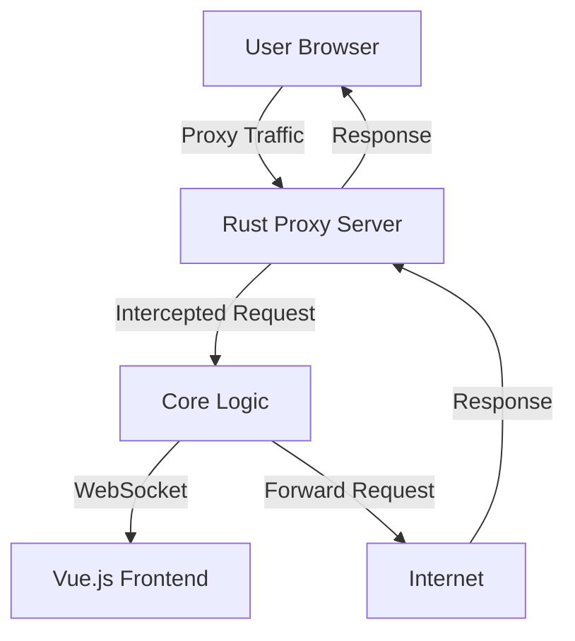

# 🏗️ System Architecture

Interceptor is built with performance and security in mind, utilizing a split architecture between a high-performance Rust backend and a modern Vue.js frontend.

## High-Level Overview

## Components

### 1. Backend (Rust)

-   **Framework**: Axum (Web Server) + Hyper (HTTP)
-   **Role**: Handles all proxy traffic, TLS termination, and core logic.
-   **State Management**: `Arc<RwLock<AppState>>` for thread-safe state sharing.
-   **Database**: SQLite (via SQLx) for storing request history and configurations.

### 2. Frontend (Vue.js)

-   **Framework**: Vue 3 + TypeScript + Vite
-   **Role**: Provides the user interface for inspection and control.
-   **Communication**: Connects to backend via WebSocket for real-time updates and REST API for commands.
-   **Styling**: TailwindCSS for responsive design.

## Key Subsystems

-   **Certificate Authority (CA)**: Manages dynamic certificate generation for MITM.
-   **Rule Engine**: Processes traffic against user-defined rules.
-   **Intruder Engine**: Manages concurrent fuzzing tasks.
-   **Scope Manager**: Filters traffic based on inclusion/exclusion rules.
